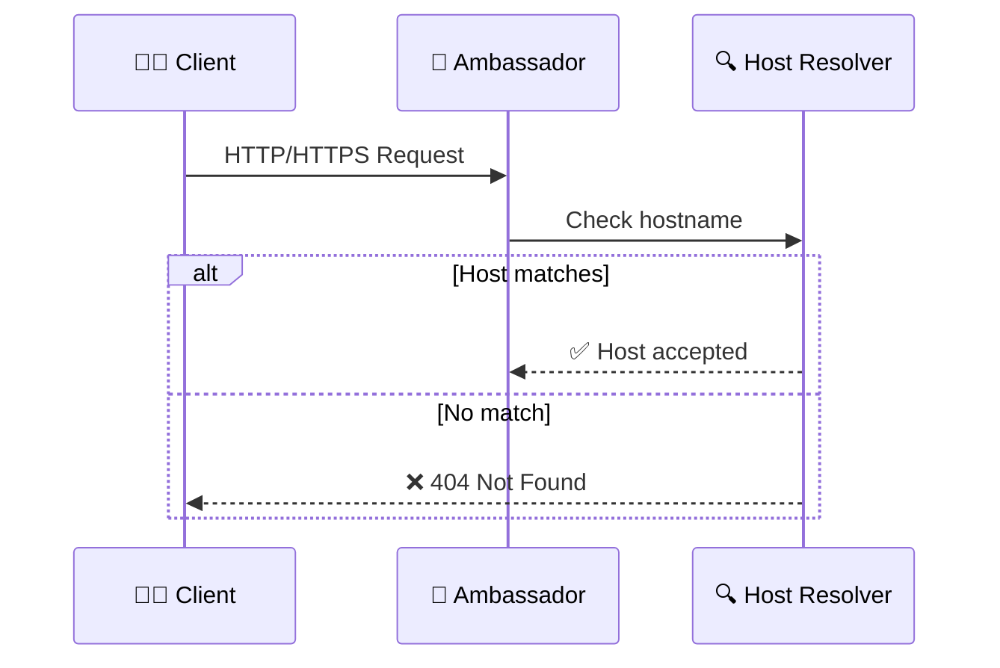

# 1. Initial Request & Host Resolution



# 2. TLS Termination

```
sequenceDiagram
    participant 🧑‍💻 Client
    participant 🚪 Ambassador
    participant 🔒 TLS Terminator

    Note over 🧑‍💻 Client,🔒 TLS Terminator: Only for HTTPS requests
    🧑‍💻 Client->>🚪 Ambassador: HTTPS Request
    🚪 Ambassador->>🔒 TLS Terminator: Decrypt request
    🔒 TLS Terminator-->>🚪 Ambassador: 🔓 Decrypted request
```

# 3. Authentication

```
sequenceDiagram
    participant 🚪 Ambassador
    participant 🛡️ Auth Service
    participant 🧑‍💻 Client

    🚪 Ambassador->>🛡️ Auth Service: Validate credentials
    alt Auth success
        🛡️ Auth Service-->>🚪 Ambassador: ✅ 200 OK (with auth headers)
    else Auth failure
        🛡️ Auth Service-->>🧑‍💻 Client: 🚫 401/403 Unauthorized
    end
```

# 4. Rate Limiting

```
sequenceDiagram
    participant 🚪 Ambassador
    participant ⏱️ Rate Limiter
    participant 🧑‍💻 Client

    🚪 Ambassador->>⏱️ Rate Limiter: Check rate limits
    alt Within limits
        ⏱️ Rate Limiter-->>🚪 Ambassador: ✅ Request allowed
    else Limits exceeded
        ⏱️ Rate Limiter-->>🧑‍💻 Client: 🛑 429 Too Many Requests
    end
```

# 5. Request Filtering & Mapping

```
sequenceDiagram
    participant 🚪 Ambassador
    participant 🧹 Filter Chain
    participant 🧭 Mapping Selector
    participant 🧑‍💻 Client

    🚪 Ambassador->>🧹 Filter Chain: Apply request filters
    🧹 Filter Chain-->>🚪 Ambassador: ✨ Filtered request

    🚪 Ambassador->>🧭 Mapping Selector: Find matching mapping
    alt Match found
        🧭 Mapping Selector-->>🚪 Ambassador: ✅ Mapping selected
    else No match
        🧭 Mapping Selector-->>🧑‍💻 Client: ❌ 404 Not Found
    end
```

# 6. Backend Routing & Circuit Breaking

```
sequenceDiagram
    participant 🚪 Ambassador
    participant 🚦 Backend Router
    participant 🔌 Circuit Breaker
    participant 💻 Backend Service
    participant 🧑‍💻 Client

    🚪 Ambassador->>🚦 Backend Router: Route to backend
    🚦 Backend Router->>🔌 Circuit Breaker: Check circuit status

    alt Circuit closed
        🔌 Circuit Breaker-->>🚦 Backend Router: ✅ Allow request
        🚦 Backend Router->>💻 Backend Service: Forward request
        💻 Backend Service-->>🚦 Backend Router: 📤 Service response
        🚦 Backend Router-->>🚪 Ambassador: 📦 Processed response
        🚪 Ambassador-->>🧑‍💻 Client: HTTP Response
    else Circuit open
        🔌 Circuit Breaker-->>🧑‍💻 Client: ⚡ 503 Service Unavailable
    end

```

# 7. Error Handling

```
sequenceDiagram
    participant 🚦 Backend Router
    participant 💻 Backend Service
    participant 🔌 Circuit Breaker
    participant 🧑‍💻 Client

    🚦 Backend Router->>💻 Backend Service: Forward request
    💻 Backend Service--x🚦 Backend Router: ❌ Service error
    🚦 Backend Router->>🔌 Circuit Breaker: Report failure

    alt Circuit threshold reached
        🔌 Circuit Breaker->>🔌 Circuit Breaker: Open circuit
    end

    🚦 Backend Router-->>🧑‍💻 Client: 💥 5xx Error Response
```

# Complete Sequence Diagram

```
sequenceDiagram
    participant Client as 🧑‍💻 Client
    participant AmbassadorService as 🚪 Ambassador Service
    participant HostResolver as 🔍 Host Resolver
    participant TLSTerminator as 🔒 TLS Terminator
    participant AuthService as 🛡️ Auth Service
    participant RateLimiter as ⏱️ Rate Limiter
    participant FilterChain as 🧹 Filter Chain
    participant MappingSelector as 🧭 Mapping Selector
    participant BackendRouter as 🚦 Backend Router
    participant BackendService as 💻 Backend Service
    participant CircuitBreaker as 🔌 Circuit Breaker

    rect rgb(255, 240, 245)
        Note over Client,AmbassadorService: 📥 Request Arrival
        Client->>+AmbassadorService: HTTP/HTTPS Request
    end

    rect rgb(230, 255, 250)
        Note over AmbassadorService,HostResolver: 🏠 Host Resolution
        AmbassadorService->>+HostResolver: Check hostname
        alt Host matches
            HostResolver-->>-AmbassadorService: ✅ Host accepted
        else No match
            HostResolver-->>Client: ❌ 404 Not Found
        end
    end

    rect rgb(240, 248, 255)
        Note over AmbassadorService,TLSTerminator: 🔐 TLS Processing
        alt HTTPS Request
            AmbassadorService->>+TLSTerminator: Decrypt request
            TLSTerminator-->>-AmbassadorService: 🔓 Decrypted request
        end
    end

    rect rgb(255, 245, 238)
        Note over AmbassadorService,AuthService: 🔑 Authentication
        alt Auth enabled
            AmbassadorService->>+AuthService: Validate credentials
            alt Auth success
                AuthService-->>-AmbassadorService: ✅ 200 OK (with auth headers)
            else Auth failure
                AuthService-->>Client: 🚫 401/403 Unauthorized
            end
        end
    end

    rect rgb(245, 255, 250)
        Note over AmbassadorService,RateLimiter: ⚖️ Rate Limiting
        alt Rate limiting enabled
            AmbassadorService->>+RateLimiter: Check rate limits
            alt Within limits
                RateLimiter-->>-AmbassadorService: ✅ Request allowed
            else Limits exceeded
                RateLimiter-->>Client: 🛑 429 Too Many Requests
            end
        end
    end

    rect rgb(248, 248, 255)
        Note over AmbassadorService,FilterChain: 🔄 Request Filtering
        AmbassadorService->>+FilterChain: Apply request filters
        FilterChain-->>-AmbassadorService: ✨ Filtered request
    end

    rect rgb(255, 253, 240)
        Note over AmbassadorService,MappingSelector: 🗺️ Mapping Selection
        AmbassadorService->>+MappingSelector: Find matching mapping
        alt Match found
            MappingSelector-->>-AmbassadorService: ✅ Mapping selected
        else No match
            MappingSelector-->>Client: ❌ 404 Not Found
        end
    end

    rect rgb(240, 255, 240)
        Note over AmbassadorService,BackendRouter,BackendService: 🚀 Backend Routing
        AmbassadorService->>+BackendRouter: Route to backend

        BackendRouter->>+CircuitBreaker: Check circuit status
        alt Circuit closed
            CircuitBreaker-->>-BackendRouter: ✅ Allow request

            BackendRouter->>+BackendService: Forward request
            BackendService-->>-BackendRouter: 📤 Service response
            BackendRouter-->>-AmbassadorService: 📦 Processed response

            BackendRouter->>CircuitBreaker: Report success
        else Circuit open
            CircuitBreaker-->>Client: ⚡ 503 Service Unavailable
        end
    end

    rect rgb(255, 240, 245)
        Note over AmbassadorService,Client: 📤 Response Return
        AmbassadorService-->>-Client: HTTP Response
    end

    rect rgb(255, 235, 235)
        Note over BackendService,Client: ⚠️ Failure Handling
        alt Backend failure
            BackendService--xBackendRouter: ❌ Service error
            BackendRouter->>CircuitBreaker: Report failure
            BackendRouter-->>Client: 💥 5xx Error Response
        end
    end

```
